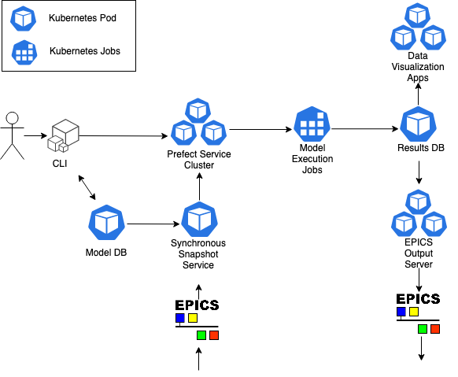

# lume-orchestration-demo

This repository contains demos of model orchestration using a set of standardized services and deployed over a Kubernetes cluster. This README describes the prerequesite setup necessary for getting started with demos for a [neural network impact surrogate of the LCLS copper injector](docs/lcls_cu_inj_nn.md) and a [distgen to impact model of the LCLS copper injector](docs/distgen_impact_cu_inj.md).

We use a [kind](https://kind.sigs.k8s.io/) local Kubernetes cluster for the deployment and networking of the following components:
- Prefect infrastructure  
  - Apollo server  
  - GraphQL  
  - Hasura (GraphQL API)  
  - Towel (server maintenance)  
  - Prefect UI  
- Results DB (mongodb)  
- Model DB (mysql 8.0.28)  
- Impact Dashboard (dockerized [Dash](https://plotly.com/dash/) application)  

Prereqs:
- kubectl
- [kind](https://kind.sigs.k8s.io/)
- docker
- conda
- helm 
- mysql




## Setup instructions (LOCAL)

### 1. Configure environment 
First, set up the conda environment for the demo:
```
conda env create -f environment.yml
conda activate lume-orchestration-demo
pip install -e .
```

Use [kind](https://kind.sigs.k8s.io/) to create a local cluster. This assumes you already have Docker configured on your machine. Create a file `kind-config.yaml` with the following information:
```
apiVersion: kind.x-k8s.io/v1alpha4
kind: Cluster
nodes:
  - role: control-plane
    extraMounts:
      - hostPath: <PATH_TO_LUME_ORCHESTRATION_DEMO>
        containerPath: <PATH_TO_LUME_ORCHESTRATION_DEMO>
```
Replace `<PATH_TO_LUME_ORCHESTRATION_DEMO>` with the path to this repository. Next, create your cluster with this configuration:
```
kind create cluster --config=kind-config.yaml
```

Configure prefect to use a backend server:
```
prefect backend server
```
### 2. Install Kubernetes components
For this demo, we use [helm](https://helm.sh/) charts for the management of Kubernetes applications and resources. Default values are overwritten by values provided in a YAML file passed during installation.

Install Prefect with the values specified in `prefect/prefect.yaml`:
```
helm repo add prefecthq https://prefecthq.github.io/server/

helm install prefect-server prefecthq/prefect-server -f prefect/prefect.yaml
```

Check that the Prefect pods are running using the command:
```
kubectl get pods
```
Which will out put something along the lines of:
```
(prefect-test) PC97901:lume-orchestration-demo jgarra$ kubectl get pods
NAME                                      READY   STATUS      RESTARTS   AGE
prefect-server-apollo-844d6bc99b-dgkfl    1/1     Running     1          2m15s
prefect-server-agent-85bc5f6cc5-g5gr6     1/1     Running     3          73s
prefect-server-create-tenant-job-6jtxb    0/1   kub  Completed   3          2m15s
prefect-server-graphql-5cdd675fdf-jj4lk   1/1     Running     0          2m15s
prefect-server-hasura-7997fb8f8c-2xmp2    1/1     Running     2          2m15s
prefect-server-postgresql-0               1/1     Running     0          2m15s
prefect-server-towel-7b988d966f-dqnpx     1/1     Running     0          2m15s
prefect-server-ui-5459c9f645-l964j        1/1     Running     0          2m15s
```
The pods may take a few minutes to stabilize as some have dependencies on one another. Once all are running, install the model tracking database using the values given in `model_db/values.yaml`. Note that the user/password combo given in this file is suitable only to a toy model and better auth must be configured for usable deployments.
```
# both mysql and mongodb use the bitnami repo, so will have to add
helm repo add bitnami https://charts.bitnami.com/bitnami
helm install model-db bitnami/mysql -f model_db/values.yaml
```
Next set up the result tracking database:
```
helm install results-db bitnami/mongodb -f results_db/values.yaml
```
Once again, you can check all of these services are running using:
```
kubectl get pods
```


### Set up port forwardings
In order to use these resources, we must be able to access the kubernetes ports. In another shell window, create port forwardings for all resources:
```
 kubectl port-forward $(kubectl get pods | grep prefect-server-apollo | awk '{n=split($2,b," "); print $1}') 4200:4200 & 
 kubectl port-forward $(kubectl get pods | grep prefect-server-ui | awk '{n=split($2,b," "); print $1}') 8080:8080 &
 kubectl port-forward $(kubectl get pods | grep results-db | awk '{n=split($2,b," "); print $1}') 27017:27017 &
 kubectl port-forward model-db-mysql-0 3306:3306 
```

You can now view the Prefect UI at http://localhost:8080.

### Apply model db schema

Next we apply the schema described in `model_db/schema.sql`. 
Log in to mysql and source the schema:

```
mysql -u root -h 127.0.0.1 -ppassword
source model_db/schema.sql
```

### Apply environment variables

The example slac_services included in this repository use a configuration file for setting up service interfaces that is indicated by the environment variable `LUME_ORCHESTRATION_CONFIG`. Configuration for these services will differ inside/outside the Kubernetes cluster. For this reason, we define a second environment variable `LUME_ORCHESTRATION_CLUSTER_CONFIG` to be passed as `LUME_ORCHESTRATION_CONFIG` to cluster jobs. `DEMO_DIR` will be used for resolving paths to demo artifacts.

```
export LUME_ORCHESTRATION_CLUSTER_CONFIG=$(pwd)/examples/cluster-config.yaml
export LUME_ORCHESTRATION_CONFIG=$(pwd)/examples/config.yaml
export DEMO_DIR=$(pwd)
```

### Demos

- [lcls-cu-inj-nn](docs/lcls_cu_inj_nn.md)  
- [distgen-impact-cu-inj](docs/distgen_impact_cu_inj.md)  